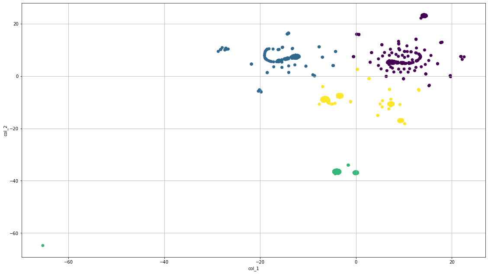

# Unsupervised_machine_learning

# Intro

The purpose of this project was to use introduce some concepts of Unsupervised Learning in Machine Learning Models.

The concepts introduced are:

- PCA
- TSNE
- K-means

# Data Set 

The data set was a collection of user various crypto currencies, their proof type, if they're actively being traded, the amount mined and total amount in supply.

# Method

First step was to load the information and get a feel for the overall quality of the dataset. At first it seemed to a simple and small dataset with a few columns with insufficient data types for the desired purposes. Columns with information not pertaining to numerical data for the currencies were dropped and the TotalCoinSupply was a list of integers but set as strings so that was converted as needed.
Currencies with TotalCoinsMined that were less than 0, and rows containing NaN values, and all currencies that were not being traded were removed from the dataset. 
Lastly, the data was scaled using the Standard Scaler from sci-kit learn.

After processing, Dummy columns were creating to transform the string entries into numerical data. PCA was used to lower the number of Features and TSNE was used to create the cluster groups.
To get a feel for the most suitable number of clusters using K-means, the inertia of the cleaned information was calumniated and graphed leaving 4 as the optimum number of clusters.

Once the clusters for K-means were found we could transform the resulting model information into a data frame and graph the information with colored labels to easily identify the clusters in the visualization.

# Analysis

The resulting graph was not something to write home about; Once processing was complete a staggering 46.5% of the data was removed, possibly contributing to a lack of proper clustering in the model.

There was little uniformity in the clusters present in the graph meaning that either the loss of data due to the dataset containing values not usable for the model or the data was too varied to be accurately clustered for this unsupervised model.

Revisiting this model and methods with a larger dataset that can be testing should reveal if the initial variance between the currencies led to the overall lack of cluster-ability within the data.

## Results:

-------------------------------------------------------------------------------------------------------------------------------------

# Conclusion

One of the aspects of machine learning is testing models with just the right hyper-parameter. In this situation  the hyper-parameter Perplexity in TSNE had the largest impact on the clustering of the data present in the final image. The perplexity that produced the clearest image was set to a value of 30. However there were instances when running the same data with the same hyper-parameter led to a different result. 

With the lack of data due to processing not taken into consideration; familiarity and understanding of each model what is needed to tune them is most valuable concept learned in this exercise, second only to having a suitable dataset for Machine Learning.

